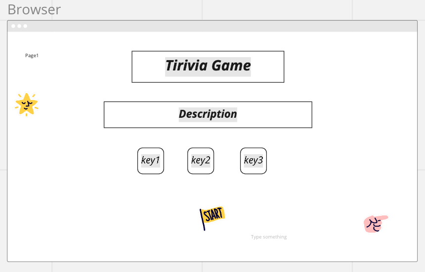
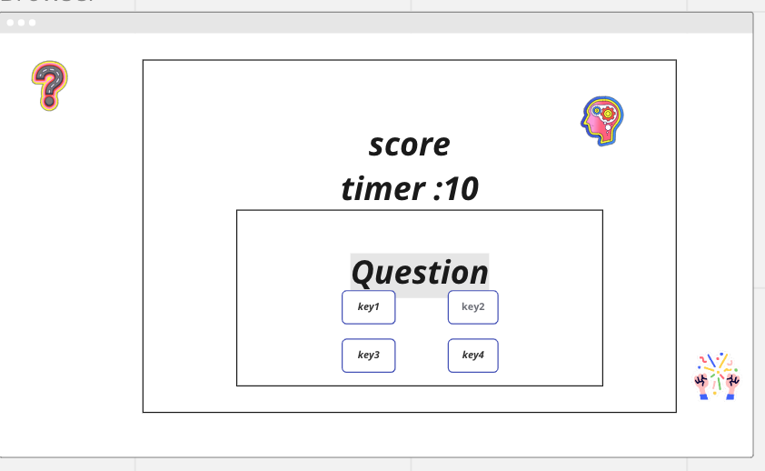

# Trivia App
 Trivia DB: https://opentdb.com/
## Reason  choose this game: 
 *I always prefer to play games like quislet. Becauseb it  helps me gain more knowledge about everything and give me fun as I answer multiple-choice questions. So I think we can make something like this game with Thrivi.*

 ##  Screen shoot:

## Make Technologies:
- *Html*
- *css*
- *javascript *js**
- *jquery*
- *add json formatting in chrome* 
- *Use AJAX to make a request to an external data source*
- *Every changes do the project , will be comitte*
- *Api Trivia* 
## Other Details:
- find google font for the text and import in css file 
- Defines a title for the document
- choose favourit image for back ground image in the game
- Write  some description for user before start the game   
- use math random choose correct answer
- use pop method to  remove incrrect answer that I have chosen
- add win lose 
- find category number for url
- add catId 
- minor improvement in css 
- add Timer by setInterval
- connect with GitHub
- add again minor improvment in ReadME

 ### Google Font
<https://fonts.googleapis.com/css2?family=Comfortaa:wght@300;400;700&family=Indie+Flower&display=swap>
###  Image  
<https://vips.org/wp-content/uploads/2018/09/question-background.png>

<API:https://opentdb.com/api_config.php>

<URL:https://opentdb.com/api.php?amount=10&difficulty=medium&type=multiple>